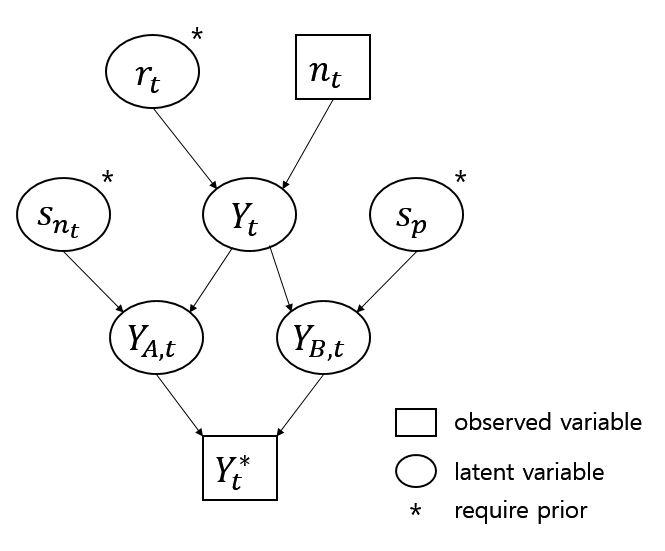

## Introduction
Code for this study provided at [https://github.com/paulgstf/misclass-covid-19-testing]
#### Contingency table and generative model

* Background: Using Rapid COVID-19 Antigen Test is controversial due to its sensitivity issue within medical society in South Korea. The purpose of this study is to see the impact of poor sensitivity in epidemic curves.
* Methods: The Bayesian method of Dr. Paul Gustafson is used. Time-series data of Ministry of Health and Welfare of South Korea for COVID-19 test status were examined through Bayesian analysis to infer the sensitivity and specificity. Different sensitivity values are simulated to see the impact of misclassification errors through Monte Carlo simulation. Clinically evaluated sensitivity values are used in the study.
* Results: Bayesian analysis about the sensitivity and specificity indicated that the value of specificity is almost 100%, which is expected from clinical performance results from other studies. On the other hand, sensitivity is inferred to be approximately 60%, which is a value in-between clinical RT-PCR performance (95%) and estimated Ag test performance (40%) from studies conducted in South Korea. Through Monte Carlo sensitivity analysis, the impact of these sensitivity values is examined. However, in most cases the number of test positives is underestimated. 
* Conclusions: The impact of misclassification due to poor sensitivity was worse than anticipated. Special cares have to be taken in using Ag test.

#### Figures

